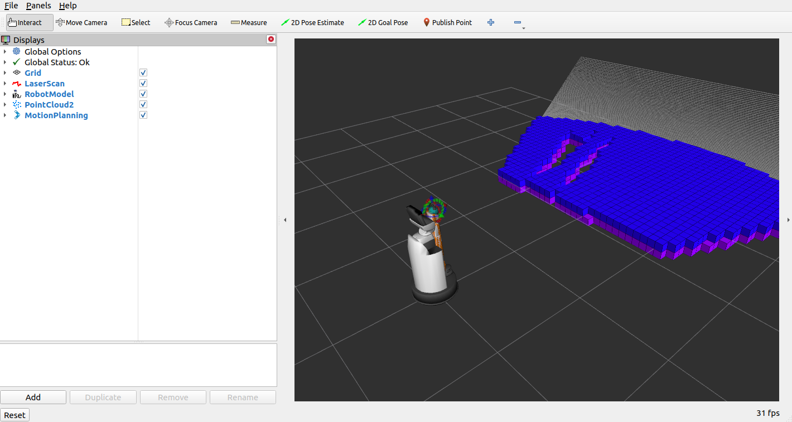
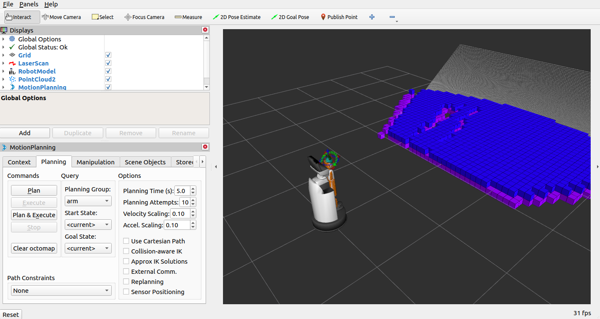

MoveIt2を使う
=======================

Pinocchioのインストール
------------------------------------
https://stack-of-tasks.github.io/pinocchio/download.html を参考に、``robotpkg-pinocchio`` をインストールしてください。
また、以下の記載を ``~/.bashrc`` に追記してください。

.. code-block:: bash

   export CMAKE_PREFIX_PATH=/opt/openrobots:$CMAKE_PREFIX_PATH

環境準備
------------------------------------

Bitbucketから以下のリポジトリを取得します。

.. code-block:: bash

   $ cd ~/repositories
   $ git clone -b foxy https://bitbucket.org/tmc-dev-xr/hsrb_manipulation.git
   $ git clone -b foxy https://bitbucket.org/tmc-dev-xr/hsrb_moveit.git
   $ git clone -b foxy https://bitbucket.org/tmc-dev-xr/tmc_manipulation_base.git

ワークスペースを作成し、対象となるパッケージのシンボリックリンクを作成します。

.. code-block:: bash

   $ mkdir ~/moveit_ws
   $ cd ~/moveit_ws
   $ ln -s ~/repositories/hsrb_manipulation/hsrb_analytic_ik
   $ ln -s ~/repositories/hsrb_common/hsrb_description
   $ ln -s ~/repositories/hsrb_common/hsrb_parts_description
   $ ln -s ~/repositories/hsrb_common/hsrc_description
   $ ln -s ~/repositories/hsrb_moveit/hsrb_moveit_config
   $ ln -s ~/repositories/hsrb_moveit/hsrb_moveit_plugins
   $ ln -s ~/repositories/tmc_manipulation_base/tmc_manipulation_types
   $ ln -s ~/repositories/tmc_manipulation_base/tmc_robot_kinematics_model

ワークスペースをビルドし、setup.bashを読み込みます。

.. code-block:: bash

   $ cd ~/moveit_ws
   $ source /opt/ros/foxy/setup.bash
   $ rosdep install --from-paths . -y --ignore-src
   $ colcon build --symlink-install --cmake-args -DCMAKE_BUILD_TYPE=Release
   $ source install/setup.bash

使用方法
------------------------------------

MoveIt2を起動する
+++++++++++++++++++++

実機またはシミュレータを起動した状態で、以下のコマンドを入力してください。

.. code-block:: bash

   $ cd ~/moveit_ws
   $ source install/setup.bash
   $ ros2 launch hsrb_moveit_config hsrb_demo.launch.py

.. note::

   **HSRC** の場合は hsrb_demo.launch.py の代わりに hsrc_demo.launch.py を利用してください。

以下の様にrvizが立ち上がり、ロボットモデル、インタラクティブマーカーが表示されたら成功です。

.. note::

   OctoMapが表示されるのはシミュレータ利用時のみです。

rvizから動かす
+++++++++++++++++++++

rvizのMotionPlanningのチェックボックスを外し、付けることで、以下の様にMotionPlanningのウィンドウが表示されます。
以降は、`公式チュートリアル <https://moveit.picknik.ai/foxy/doc/quickstart_in_rviz/quickstart_in_rviz_tutorial.html>`_ を参考に、MoveIt2をご利用ください。

Move Group C++ Interfaceから動かす
+++++++++++++++++++++++++++++++++++++++++

hsrb_moveit_configには、Move Group C++ Interfaceの、HSRでの使用例が含まれています。
以下のコマンドで、使用例一覧を確認できます。

.. code-block:: bash

   $ ll ~/repositories/hsrb_moveit/hsrb_moveit_config/example/

実行するには、以下のコマンドを入力してください。example_nameは、適当な使用例の名前に変更してください。

.. code-block:: bash

   $ cd ~/moveit_ws
   $ source install/setup.bash
   $ ros2 launch hsrb_moveit_config hsrb_example.launch.py example_name:=moveit_fk_demo

.. note::

   **HSRC** の場合は hsrb_example.launch.py の代わりに hsrc_example.launch.py を利用してください。