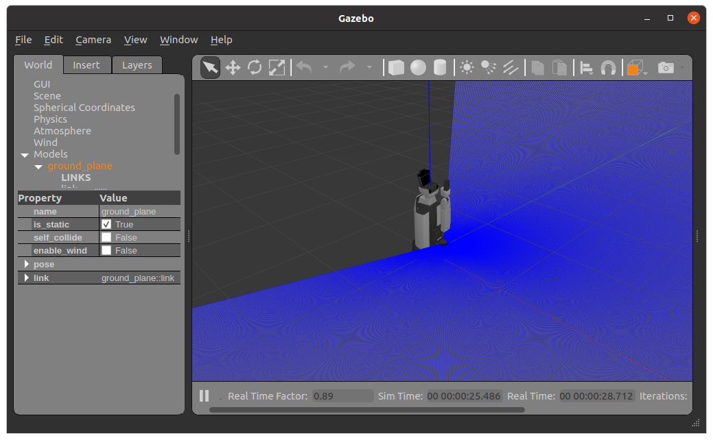

開発PCのセットアップ
=======================

gazeboシミュレータ用推奨スペック
------------------------------------

シミュレータを動作させるには、ある程度スペックの高いPCが必要となります。
スペックが低いPCだと安定してシミュレータを動作させることができない可能性があるので注意してください。

また、OSやROSのバージョンが異なったり、仮想環境で実行した場合も、不要なトラブルが発生する可能性が高く、
短い期間で解決することが困難であることが予想されるため、お勧めしません。

推奨スペック(これ以下でも動作は可能です)
  * OS: Ubuntu 20.04 64-bit (必須)
  * ROS2: foxy (必須)
  * CPU: Core i7 以上
  * メモリ: 4GB以上(8GB以上をお勧めします)
  * HDD空き容量: 2GB以上
  * GPU: NVIDIAチップが搭載されたグラフィックカード

セットアップ手順
-------------------

ROS2のインストール
+++++++++++++++++++++

https://docs.ros.org/en/foxy/Installation/Ubuntu-Install-Debians.html を参考に、``ros-foxy-desktop`` と ``ros-foxy-ros-base`` をインストールしてください。

colconのインストール
+++++++++++++++++++++

https://docs.ros.org/en/foxy/Tutorials/Colcon-Tutorial.html を参考に、``python3-colcon-common-extensions`` をインストールしてください。

rosdepのインストール
+++++++++++++++++++++

https://docs.ros.org/en/foxy/How-To-Guides/Building-a-Custom-Debian-Package.html を参考に、``python3-rosdep`` をインストールし、rosdepの初期化を実行してください。

HSRシミュレータのインストール
+++++++++++++++++++++++++++++

Bitbucketから以下のリポジトリを取得します。

.. code-block:: bash

   $ mkdir ~/repositories
   $ cd ~/repositories
   $ git clone -b foxy-tmc https://bitbucket.org/tmc-dev-xr/gazebo_ros2_control.git
   $ git clone -b foxy https://bitbucket.org/tmc-dev-xr/hsrb_common.git
   $ git clone -b foxy https://bitbucket.org/tmc-dev-xr/hsrb_controllers.git
   $ git clone -b foxy https://bitbucket.org/tmc-dev-xr/hsrb_simulator.git
   $ git clone -b foxy https://bitbucket.org/tmc-dev-xr/tmc_gazebo.git
   $ git clone -b foxy https://bitbucket.org/tmc-dev-xr/tmc_realtime_control.git

ワークスペースを作成し、対象となるパッケージのシンボリックリンクを作成します。

.. code-block:: bash

   $ mkdir ~/ros2_ws
   $ cd ~/ros2_ws
   $ ln -s ~/repositories/gazebo_ros2_control/gazebo_ros2_control
   $ ln -s ~/repositories/hsrb_common/hsrb_description
   $ ln -s ~/repositories/hsrb_common/hsrb_parts_description
   $ ln -s ~/repositories/hsrb_common/hsrc_description
   $ ln -s ~/repositories/hsrb_controllers/hsrb_base_controllers
   $ ln -s ~/repositories/hsrb_simulator/hsrb_gazebo_bringup
   $ ln -s ~/repositories/tmc_gazebo/tmc_gazebo_plugins
   $ ln -s ~/repositories/tmc_realtime_control/tmc_control_msgs

ワークスペースをビルドし、setup.bashを読み込みます。

.. note::

   ROS1のsetup.bashが先に読み込まれていると、 ``rosdep install`` が正常に実施されません。
   ``~/.bashrc`` 等で自動読み込みの設定を行っている場合、一時的に自動読み込みを無効化するか、 ``unset ROS_PACKAGE_PATH`` を実行してから、
   ``rosdep install`` を実施してください。

.. code-block:: bash

   $ cd ~/ros2_ws
   $ source /opt/ros/foxy/setup.bash
   $ rosdep install --from-paths . -y --ignore-src
   $ colcon build --symlink-install --cmake-args -DCMAKE_BUILD_TYPE=Release
   $ source install/setup.bash
   

シミュレータの起動
+++++++++++++++++++++

以下コマンドを実行して、gazeboシミュレータを起動します。

.. code-block:: bash

   $ ros2 launch hsrb_gazebo_bringup gazebo_bringup.launch.py

以下コマンドを実行して、ロボットモデルを読み込み、各種コントローラを起動します。

**HSRBの場合**

.. code-block:: bash

   $ ros2 launch hsrb_gazebo_bringup spawn_hsrb.launch.py

**HSRCの場合**

.. code-block:: bash

   $ ros2 launch hsrb_gazebo_bringup spawn_hsrc.launch.py

以下の様にgazeboが立ち上がり環境が確認できたら成功です。

これでシミュレータの起動確認は完了です。
